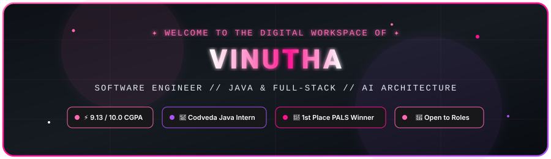
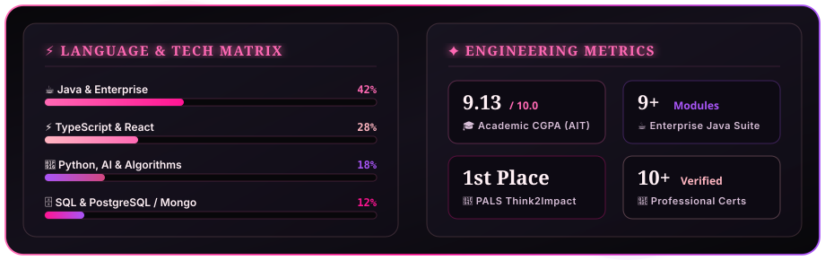
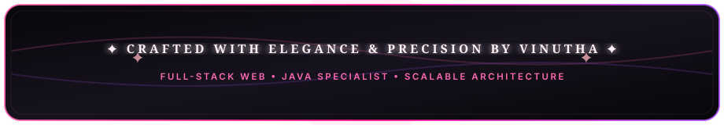

  <!-- 🌸 Animated Aesthetic Hero Banner -->
  

    

  <!-- 🌸 Quick Action Badges -->
  

    
    
    
    
    
  

   

  <!-- ⌨️ Dynamic Typing Animation -->
  

 

  

<!-- ================================================================= -->
<!-- 🌸 ABOUT ME 🌸 -->
<!-- ================================================================= -->

###  **About Me**

<blockquote>
  

    <b>Hi, I'm Vinutha</b> — an <b>Information Science &amp; Engineering</b> student at <i>Adichunchanagiri Institute of Technology</i> (<b>CGPA: 9.13 / 10.0</b>) and <b>Java Development Intern</b> at <i>Codveda Technologies</i>.
  

  

    I specialize in architecting scalable full-stack applications, robust Java enterprise systems, and AI-driven platforms. With a relentless focus on clean software design patterns, optimized algorithms, and high visual polish, I build solutions that marry technical rigor with refined aesthetics.
  

</blockquote>

 

  

<!-- ================================================================= -->
<!-- ⚡ SKILLS & TECHNOLOGIES ⚡ -->
<!-- ================================================================= -->

###  **Skills &amp; Technologies**

| Category | Technologies &amp; Frameworks |
| :--- | :--- |
| **Languages** |       |
| **Web &amp; APIs** |       |
| **Databases &amp; Cloud** |       |
| **Core Strengths** |    |

 

  

<!-- ================================================================= -->
<!-- 🚀 FEATURED REPOSITORIES 🚀 -->
<!-- ================================================================= -->

###  **Featured Repositories**

| Project | Description | Stack | Status | Link |
| :--- | :--- | :---: | :---: | :---: |
| **🤖 LockedIn** | Next-generation **AI Mock Interview Platform** featuring dynamic question generation, real-time voice/text assessment, and intelligent performance feedback. |   | `⚡ Active` | [**View Repo →**](https://github.com/Vinutha1010/LockedIn) |
| **☕ Codveda-Java-Projects** | Comprehensive enterprise repository containing **9 Java projects** across 3 tiers — console utilities, OOP architecture, file I/O, JDBC persistence, and socket networking. |   | `✓ Complete` | [**View Repo →**](https://github.com/Vinutha1010/Codveda-Java-Projects) |
| **⏱️ Java-stopwatch-timer** | Sleek, customizable, always-on-top **Java Swing desktop stopwatch & timer** featuring animated countdowns and multi-theme support. |   | `✓ Complete` | [**View Repo →**](https://github.com/Vinutha1010/Java-stopwatch-timer) |
| **📚 Java-beginner-projects** | Curated collection of modular Java applications demonstrating fundamental computer science principles, data structures, and OOP architecture. |  | `✓ Complete` | [**View Repo →**](https://github.com/Vinutha1010/Java-beginner-projects) |

 

   <b><a href="https://github.com/Vinutha1010?tab=repositories">✦ Explore all public repositories &amp; open-source contributions on GitHub →</a></b>

 

  

<!-- ================================================================= -->
<!-- 🏆 CERTIFICATIONS & ACHIEVEMENTS 🏆 -->
<!-- ================================================================= -->

###  **Certifications &amp; Achievements**

| Organization / Platform | Award &amp; Credential | Distinction / Standing |
| :--- | :--- | :---: |
|  **PALS** | **1st Place Winner**: Think2Impact Workshop | 🥇 **Champion** |
|  **Smart India Hackathon** | SIH 2025 Participant – *Disaster Management Track* | 🚀 **Participant** |
|  **NPTEL (IIT Kharagpur)** | Data Structures &amp; Algorithms using Java | 🎖️ **Elite** |
|  **NPTEL** | The Joy of Computing using Python | 🎖️ **Elite** |
|  **NPTEL** | Data Mining for Decision Making | 📜 **Certified** |
|  **MongoDB University** | MongoDB Certified: Document Model &amp; Atlas | 📜 **Certified** |
|  **Simplilearn** | PostgreSQL — Become an SQL Developer | 📜 **Certified** |
|  **Simplilearn** | AWS Cloud Services Fundamentals for Beginners | 📜 **Certified** |
|  **Cisco Networking Academy** | Introduction to Cybersecurity | 📜 **Certified** |
|  **Skill India Digital** | Artificial Intelligence (AI) Certification (270 Hours) | 📜 **Certified** |

 

  

<!-- ================================================================= -->
<!-- 📊 GITHUB TELEMETRY & STATS 📊 -->
<!-- ================================================================= -->

###  **GitHub Telemetry &amp; Engineering Metrics**

  

    

  <!-- Real-Time Activity Badges -->
  

    
    
    
    
  

 

  

<!-- ================================================================= -->
<!-- 🐍 CONTRIBUTION ACTIVITY SNAKE 🐍 -->
<!-- ================================================================= -->

###  **Contribution Activity**

  

 

  

<!-- ================================================================= -->
<!-- 💬 GET IN TOUCH & FOOTER BANNER 💬 -->
<!-- ================================================================= -->

  

    
    
    
  

   

  

